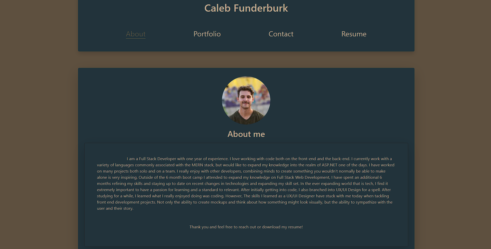

# React Portfolio

## Deployed Website

https://CalebFunderburk.github.io/ReactPortfolio/

## Description

The purpose of this project was to provide myself with a platform to showcase my work and experience as a software developer. I decided to use React in order to build a single page application that conditionally renders each section of the website. Bootstrap was used for positioning and sizing, where custom CSS was used to create a custom color palette for the website.

## Built With

- Express
- Node.JS
- React
- Bootstrap
- CSS3

## Screenshot

### Contributions

- Caleb Funderburk